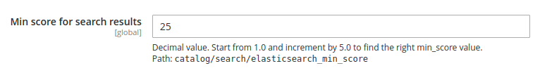

# Magento 2 Elasticsearch Relevance

Magento 2 module to set the min_score of elasticsearch search results.

## Installation
```bash
composer require mooore/magento2-module-elasticsearch-relevance
bin/magento setup:upgrade
```

## Configuration
The min_score can be set in the Magento 2 Backend(`Catalog -> Catalog Search -> Min score for search results`):


